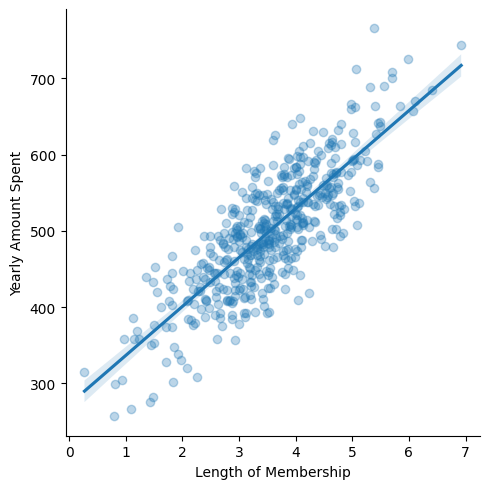

# Ecommerce Spending Prediction

📊 Project Overview
This project follows a standard machine learning pipeline:

1. Data Analysis & Visualization
Using seaborn and matplotlib to explore correlations
Understanding feature importance and customer behavior

2. Data Preparation
Loading data with pandas
Feature selection and train-test split with scikit-learn

3. Model Training
Applied Linear Regression using scikit-learn
Fitted model on training data

4. Evaluation
Measured performance using MAE, MSE, and RMSE
Plotted residuals and prediction vs actual values

The model provides a good approximation of customer spending based on a few behavioral metrics, and the analysis reveals whether mobile app engagement or website usage has a stronger influence on revenue.
